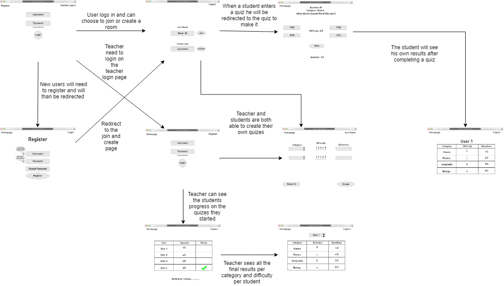

# Technisch ontwerp

# Lijst plugins en frameworks:
-Flask framework: https://www.fullstackpython.com/flask.html 
-SQL plugin: https://www.w3schools.com/sql/sql_intro.asp 
-Bootstrap: https://getbootstrap.com/docs/4.2/getting-started/introduction/ 
-Flask plugins: Flask, flash, redirect, render_template, request, session, url_for en 

# Controllers:

- Login: POST request, de homepage-1 pagina hoort bij de login. Login verwijst een reeds geregistreerde gebruiker naar homepage-2.
- Teacher-login: POST request, teacher_login pagina hoort bij teacher-login. Teacher login verwijst een reeds geregistreerde gebruiker naar homepage-2
- Register: POST request, de register pagina hoort bij register. Register slaat een gebruiker op in de database, waardoor de gebruiker op een later moment kan inloggen. 
- Create: POST request, hoort create pagina bij. met create kan een nieuwe quiz gemaakt worden.
-Logout: GET request, hoort geen specifieke pagina bij, maar na inloggen kan een gebruiker op elk gegeven moment gebruik maken van logout.
- Studentresult: POST request, hoort result pagina bij van leerlingen, na maken van quiz worden resultaten hierop weergeven
- Teacherresult: POST request, hoort result pagina bij van docenten, na maken van quiz worden resultaten van alle leerlingen hierop weergeven.

# Helpers:

- Een functie zoals Apology(): dient als foutmelding bij bijvoorbeeld een opengelaten veld bij de registratie of tijdens het inloggen.
- een login required functie, geeft aan dat een gebruiker moet inloggen.

# View bestanden:

- apology.html
- create.html
- homepage.html
- index.html
- layout.html
- login.html
- register.html
- result_student.html
- result_teacher.html
